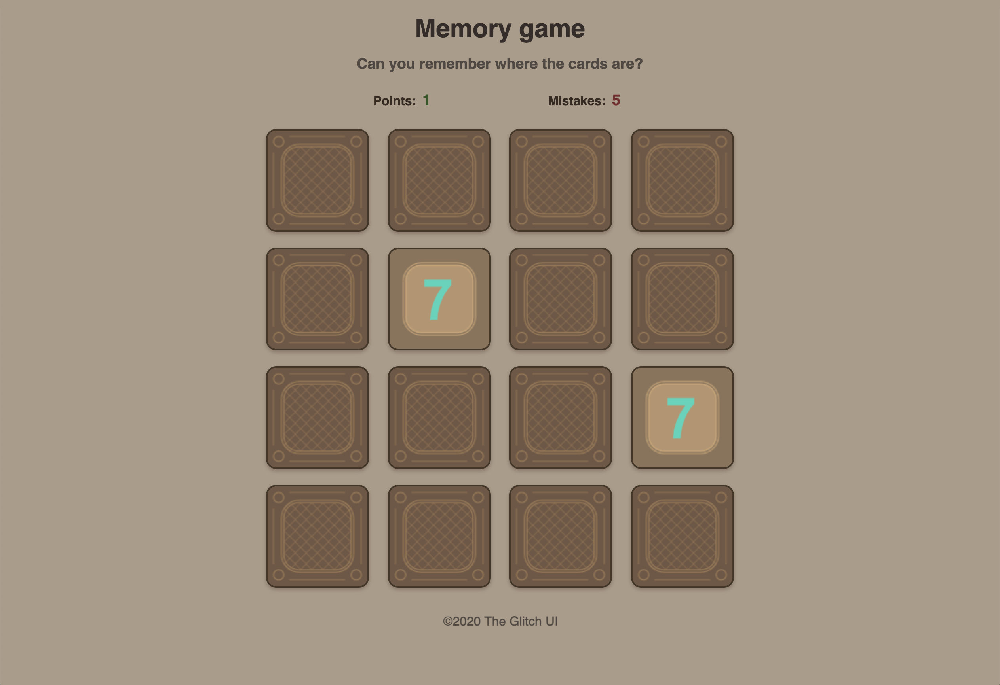

# Memory game in React

> Having fun putting to practice my knowledge on React + JavaScript ES6+

## Table of contents

- [General info](#general-info)
- [Screenshots](#screenshots)
- [Technologies](#technologies)
- [Setup](#setup)
- [Features](#features)
- [Skills practised](#skills)
- [Status](#status)
- [Inspiration](#inspiration)
- [Contact](#contact)

## General info

Starting from a create-react-app, this project updates the UI taking the card objects information from a array in the state and uses several functions to handle and evaluate the player choices.

## Screenshots

## Built with

- React - version 16.13.1 (create-react-app)

## Setup

Clone and "npm start"

## Features

Current features:

- Load images in card components
- Shuffle cards position
- Flip / unflip cards
- Detect when flipping 2 cards and...
- ...evaluate them after that
- Block already scored cards
- Update the score / mistakes count
- Once finished, use a button to reset the game (scores, unflip all cards, shuffle again)

## Skills practised

1. React

   - Updating the state
   - Reusable components

2. JavaScript (ES2015 / ES6)

   - Event handlers
   - Arrow functions
   - Destructuring arguments
   - Ternary operators
   - Spread operator
   - Immutable updates
   - Conditional rendering
   - map/filter array
   - Asynchronous JavaScript
   - Regular expresions

3. HTML5 & CSS3

   - Media Queries
   - CSS Grid
   - Flexbox
   - Box-Shadow
   - Transform

4. Design
   - User Interface

## Status

Project is: _finished_

## Inspiration

Shuffle function inspired on Sandra Israel-Ovirih's and Nguyen Quyet's

## Contact

Created by [@theglitchui](https://www./)
